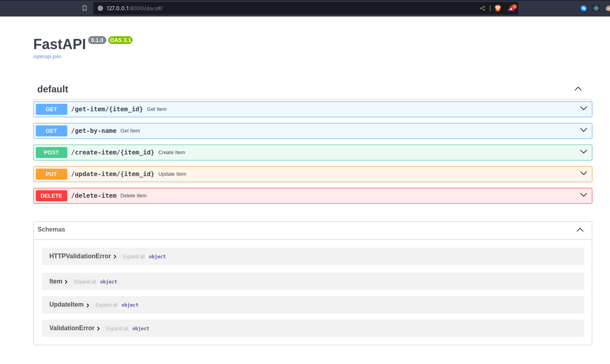

# python-API

this is a simple API build with fastAPI

## Installation

Use the package manager [pip](https://pip.pypa.io/en/stable/) to install fastAPI and uvicorn.

```bash
pip install fastapi
pip install uvicorn
```

## or you can install all the packages in the requirements.txt file

```bash
pip install -r requirements.txt
```

## Usage

> Uvicorn is a lightning-fast ASGI server implementation, using uvloop and httptools.

```bash
# run the server using uvicorn
# server is the name of the file
# app is the name of the fastAPI instance
# --reload flag will reload the server when you make changes to the code

uvicorn server:app --reload
```

## Documentation

> FastAPI provides a great documentation interface for your API

```bash
# to access the documentation
# go to http://localhost:8000/docs
```

